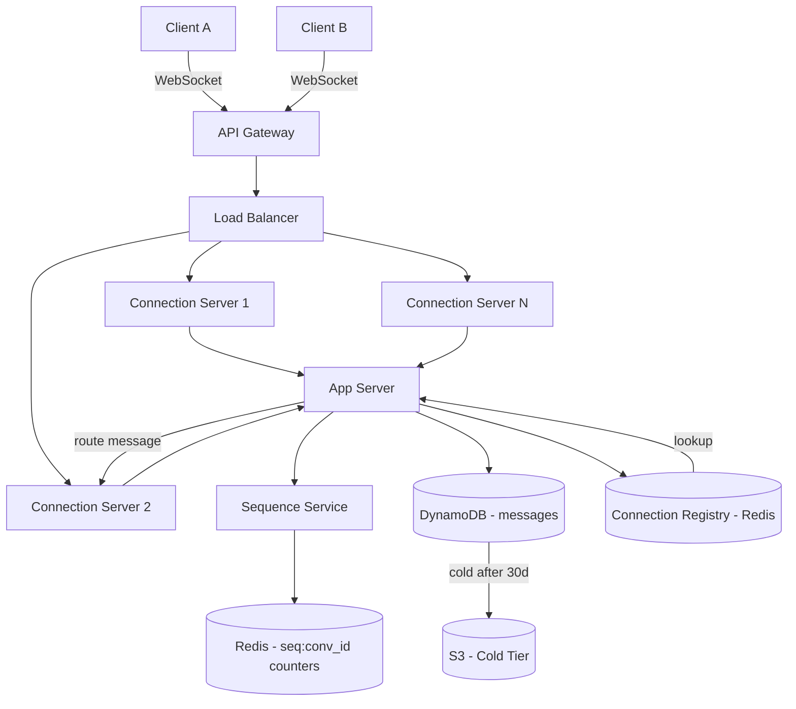

> [!info] Architecture after Message Ordering deep dive
> A dedicated sequence service is added. The messages schema gains a seq_number column. Display time is separated from server time.

---

## What changed from base architecture

The base architecture had no ordering mechanism. Messages were stored as they arrived — race conditions meant two messages sent at the same millisecond could arrive out of order. After this deep dive, ordering is enforced by a dedicated service.

---

## Changes

**1. Sequence Service added**

A new component sits between the app server and the database. Before any message is written to DynamoDB, the app server calls the Sequence Service to get the next seq number for that conversation:

```
App Server → Sequence Service → Redis INCR(seq:conv_id) → returns next seq
App Server → DynamoDB write with seq_number assigned
```

The Sequence Service is a thin wrapper around Redis INCR — atomic, monotonically increasing, per-conversation.

**2. Messages schema — seq_number as sort key**

From the DB deep dive, the sort key was `seq_number`. This deep dive establishes where that number comes from:

```
messages table:
  PK = conversation_id
  SK = seq_number           ← assigned by Sequence Service, not client
  Attributes: message_id, sender_id, content, server_timestamp, display_time
```

**3. Display time vs server timestamp**

Two time fields on every message:
- `server_timestamp` — when the server received the message (used for ordering)
- `display_time` — the client's local time when the user hit send (shown in the UI)

Client timestamps are untrusted for ordering (clock skew, manipulated clocks). Server timestamp is ground truth for seq assignment. Display time is cosmetic only.

---

## Updated architecture diagram


