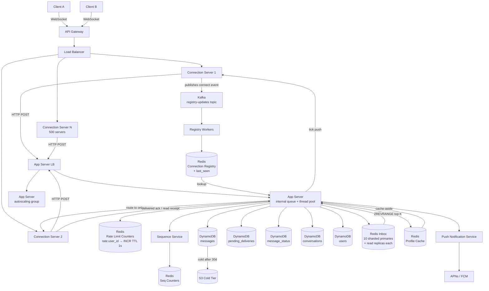

> [!info] Architecture after Peak Traffic deep dive
> Four changes from the caching architecture: inbox Redis is sharded across 10 primaries with read replicas, registry writes go through Kafka, rate limiting uses a centralised Redis counter, and app servers have internal queues with auto-scaling.

---

## What changed

**1. Inbox Redis — sharded across 10 primaries**

Previously a single Redis node. Under New Year's midnight load, a single primary cannot handle ~1M writes/second.

```
Sharding:   user_id % 10 → routes to correct primary
Each shard: 1 primary + N read replicas
Reads:      served from replicas (stale by milliseconds — acceptable)
Writes:     go to primary only
TTL:        extended to 26 hours ahead of known high-traffic events
```

**2. Registry writes — async via Kafka**

Previously synchronous write on connect. Under connection storm, 500M simultaneous registry writes overwhelm Redis.

```
On connect:    connection server publishes event to Kafka
Consumer pool: registry workers drain Kafka → write to Redis at controlled rate
Fallback:      registry miss → treat as offline → pending_deliveries
```

**3. Rate limiting — centralised Redis counter**

```
Key:    rate:<user_id>
Op:     INCR on every message (atomic)
TTL:    1 second
Limit:  10 messages/second
Reject: app server returns 429 → connection server sends WS error to client
```

**4. App server — internal queue + auto-scaling**

```
Queue:        in-memory, in front of thread pool
Capacity:     set via load testing (e.g. 50K requests)
Queue full:   returns 429 to connection server
Auto-scaling: triggers on CPU/queue depth, new servers ready in 2-3 min
```

---

## Updated architecture diagram



---

## Peak traffic capacity summary

| Component | Normal | Peak (New Year) | Mechanism |
|---|---|---|---|
| Inbox Redis | 1 primary | 10 primaries + replicas | shard by user_id % 10 |
| Registry writes | sync | async via Kafka | consumer pool drains at 100K/s per shard |
| Rate limiting | — | 10 msg/s per user | centralised Redis INCR |
| App servers | N | N + auto-scaled | in-memory queue absorbs 2-3 min gap |
